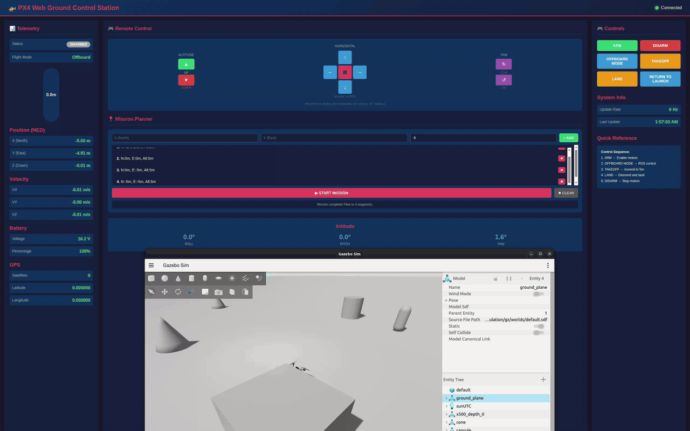
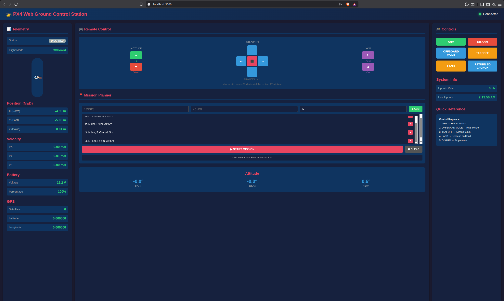
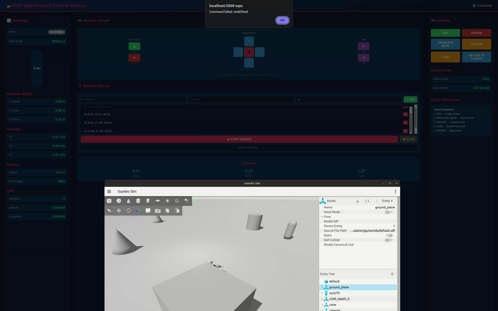
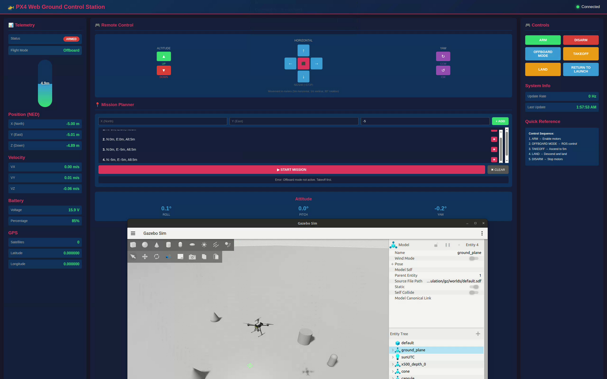
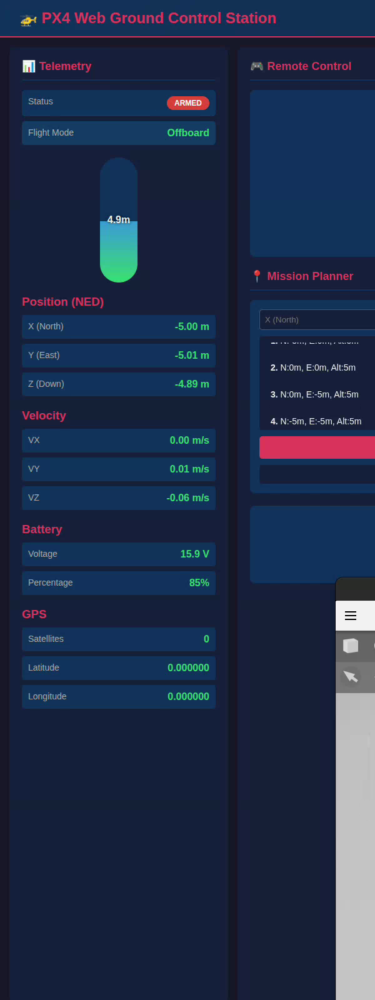

# PX4 ROS 2 Drone Control Workspace

[](https://docs.ros.org/en/humble/)
[](https://px4.io/)
[](https://www.python.org/)
[](https://isocpp.org/)
[](LICENSE)

A complete ROS 2 workspace for autonomous drone development using PX4 Autopilot. Features desktop GUI control, web-based Ground Control Station, Gazebo simulation, and comprehensive offboard control examples.

<p align="center">
  
</p>

## Features

- **Desktop GUI Control** - PyQt5-based interface with real-time telemetry, joystick control, and camera visualization
- **Web Ground Control Station** - Browser-based GCS accessible from any device on the network
- **Offboard Control** - Python and C++ examples for autonomous flight
- **Gazebo Simulation** - Full SITL environment with X500 quadcopter and depth camera
- **Real-time Telemetry** - Position, attitude, velocity, GPS, and battery monitoring at 100+ Hz
- **Mission Planning** - Waypoint-based autonomous flight with the Web GCS
- **High-level C++ Library** - Abstracted interfaces for rapid PX4 development

## Demo

### Web Ground Control Station

<p align="center">
  
</p>

### Flight Control Panel

<p align="center">
  
</p>

### Gazebo Simulation

| Takeoff | In Flight | Maneuvering |
|:-------:|:---------:|:-----------:|
|  |  |  |

### Flight Maneuvers

<p align="center">
  
</p>

## Architecture

```
┌─────────────────────────────────────────────────────────────────┐
│                        User Interfaces                          │
├──────────────────┬──────────────────┬──────────────────────────┤
│  Desktop GUI     │    Web GCS       │   Custom ROS 2 Nodes     │
│  (PyQt5)         │    (Flask)       │   (Python/C++)           │
└────────┬─────────┴────────┬─────────┴────────────┬─────────────┘
         │                  │                      │
         └──────────────────┼──────────────────────┘
                            │
              ┌─────────────▼─────────────┐
              │      ROS 2 Humble         │
              │   /fmu/in/* (commands)    │
              │   /fmu/out/* (telemetry)  │
              └─────────────┬─────────────┘
                            │
              ┌─────────────▼─────────────┐
              │   MicroXRCE-DDS Agent     │
              │      (UDP port 8888)      │
              └─────────────┬─────────────┘
                            │
              ┌─────────────▼─────────────┐
              │      PX4 Autopilot        │
              │   (SITL in Gazebo)        │
              └───────────────────────────┘
```

## Requirements

| Component | Version |
|-----------|---------|
| Ubuntu | 22.04 LTS |
| ROS 2 | Humble |
| PX4-Autopilot | v1.14+ |
| Gazebo | Garden or newer |
| Python | 3.10+ |
| MicroXRCE-DDS Agent | Latest |

### Python Dependencies
- PyQt5
- Flask, Flask-SocketIO
- OpenCV (cv2)
- NumPy

## Quick Start

### 1. Clone and Build

```bash
# Clone the repository
git clone https://github.com/AndresIslas99/PX4_ROS2_DroneControl.git
cd PX4_ROS2_DroneControl

# Build the workspace
source /opt/ros/humble/setup.bash
colcon build

# Source the workspace
source install/setup.bash
```

### 2. Start the System

```bash
# Recommended: Use the automated startup script
./start_fixed.sh
```

Wait for the "System is Ready!" message before proceeding.

### 3. Run Your Application

**Desktop GUI:**
```bash
source install/setup.bash
drone_control_gui
```

**Web Ground Control Station:**
```bash
./start_web_gcs_complete.sh
# Open http://localhost:5000 in your browser
```

**Offboard Control Example:**
```bash
source install/setup.bash
ros2 run px4_ros_com offboard_control.py
```

## Packages

| Package | Description |
|---------|-------------|
| **px4_msgs** | ROS 2 message definitions for PX4 uORB topics |
| **px4_ros_com** | Communication bridge with Python/C++ examples |
| **px4_ros2_cpp** | High-level C++ interface library for PX4 |
| **drone_control_gui** | PyQt5 desktop application for drone control |
| **web_gcs** | Flask-based web Ground Control Station |

## Usage Examples

### Sensor Data Listener

```bash
# Monitor IMU data
ros2 run px4_ros_com sensor_combined_listener

# Monitor GPS position
ros2 run px4_ros_com vehicle_gps_position_listener
```

### Autonomous Takeoff and Land

```bash
# Python version
ros2 run px4_ros_com offboard_control.py

# C++ version
ros2 run px4_ros_com offboard_control
```

### Desktop GUI Controls

1. Click **ENABLE OFFBOARD** to engage offboard mode
2. Click **ARM** to arm the vehicle
3. Click **TAKEOFF** to ascend to 5m altitude
4. Use the **joystick** for manual position control
5. Click **LAND** to initiate landing sequence

## ROS 2 Topics

### Commands (to PX4)

| Topic | Message Type | Description |
|-------|--------------|-------------|
| `/fmu/in/offboard_control_mode` | OffboardControlMode | Control mode configuration |
| `/fmu/in/trajectory_setpoint` | TrajectorySetpoint | Position/velocity setpoints |
| `/fmu/in/vehicle_command` | VehicleCommand | Arm, disarm, mode changes |

### Telemetry (from PX4)

| Topic | Message Type | Description |
|-------|--------------|-------------|
| `/fmu/out/sensor_combined` | SensorCombined | IMU data (gyro, accelerometer) |
| `/fmu/out/vehicle_attitude` | VehicleAttitude | Orientation (quaternion) |
| `/fmu/out/vehicle_local_position` | VehicleLocalPosition | Position in NED frame |
| `/fmu/out/vehicle_status` | VehicleStatus | Flight mode, arming state |

View all available topics:
```bash
ros2 topic list | grep fmu
```

## Project Structure

```
PX4_ROS2_DroneControl/
├── src/
│   ├── px4_msgs/                 # PX4 message definitions
│   ├── px4_ros_com/              # PX4-ROS 2 bridge and examples
│   ├── px4-ros2-interface-lib/   # High-level C++ library
│   ├── drone_control_gui/        # Desktop GUI application
│   └── web_gcs/                  # Web Ground Control Station
├── docs/                         # Additional documentation
├── images/                       # Screenshots and GIFs
├── start_fixed.sh                # Main startup script
├── start_clean.sh                # Single-terminal startup
├── start_drone_gui.sh            # Multi-window GUI startup
└── start_web_gcs_complete.sh     # Web GCS startup
```

## Documentation

- [Quick Reference](docs/QUICK_REFERENCE.md) - Command cheat sheet and topic reference
- [Web GCS Guide](docs/WEB_GCS_GUIDE.md) - Web interface documentation
- [Flight Sequence Guide](docs/FLIGHT_SEQUENCE_GUIDE.md) - Flight operation procedures
- [Troubleshooting](docs/TROUBLESHOOTING.md) - Common issues and solutions
- [Camera Setup](docs/CAMERA_SETUP.md) - Camera and sensor configuration

### External Resources

- [PX4 ROS 2 User Guide](https://docs.px4.io/main/en/ros2/user_guide)
- [PX4 Offboard Control](https://docs.px4.io/main/en/ros2/offboard_control)
- [PX4 ROS 2 Interface Library](https://docs.px4.io/main/en/ros2/px4_ros2_interface_lib)

## Troubleshooting

### No ROS 2 Topics

```bash
# Check if MicroXRCE Agent is running
ps aux | grep MicroXRCEAgent

# Restart everything
killall -9 px4 gz MicroXRCEAgent
./start_fixed.sh
```

### GUI Shows No Data

1. Wait at least 20 seconds after starting the simulation
2. Verify topics are publishing: `ros2 topic echo /fmu/out/sensor_combined --once`
3. Run the diagnostic script: `./diagnose_and_fix.sh`

### Build Errors

```bash
# Clean rebuild
rm -rf build install log
source /opt/ros/humble/setup.bash
colcon build
```

## Contributing

Contributions are welcome! Please read [CONTRIBUTING.md](CONTRIBUTING.md) for guidelines on:

- Reporting bugs
- Suggesting features
- Submitting pull requests
- Code style requirements

## License

This project is licensed under the Apache License 2.0 - see the [LICENSE](LICENSE) file for details.

### Third-Party Licenses

- **px4_msgs**, **px4_ros_com**: BSD 3-Clause (PX4)
- **px4_ros2_cpp**: BSD 3-Clause (Auterion)

## Author

**Andres Islas Bravo**

- Email: andresislas2107@gmail.com
- GitHub: [@AndresIslas99](https://github.com/AndresIslas99)

Feel free to reach out for questions, collaborations, or feedback!

## Acknowledgments

- [PX4 Autopilot](https://px4.io/) - Open source flight control software
- [ROS 2](https://ros.org/) - Robot Operating System
- [Gazebo](https://gazebosim.org/) - Robot simulation
- [Auterion](https://auterion.com/) - px4_ros2_cpp library

---

<p align="center">
  
</p>
